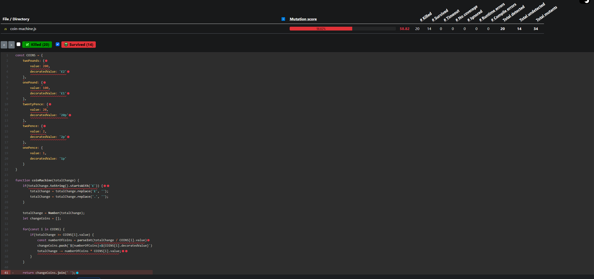

# Coin Machine KATA with Mutation Testing
The purpose of this project is to show the use of mutation testing for improved visibility of unit test coverage and
quality.

The kata used was [the coin machine kata](kata/coin-machine.md)

## Prerequisites 
 * Node version v16.13.2. If using NVM, use `nvm use`
 * NPM v8.1.2+

## Running the Application
```
    npm i
    npm test
    npm run test:mutation // Runs mutation test coverage
```

## Mutation Test Results

